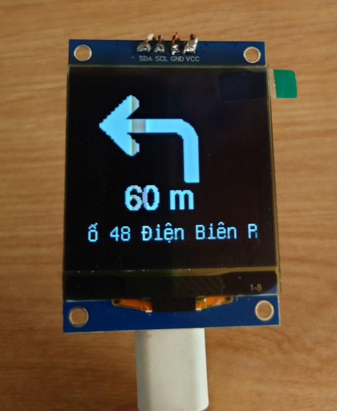

# WeNav

This repository contains the firmware for the WeNav navigation device, which based on ESP32 to display navigation data on either a TFT or OLED screen. The firmware supports BLE communication for receiving navigation data and rendering it on the display.

## Demo

TFT version


OLED version



## Features

- **BLE Communication**: Receives navigation data via BLE.
- **Display Support**:
  - TFT Display (ST7789)
  - OLED Display (GME128128)
- **Dynamic Rendering**:
  - Displays navigation data such as title, ETA, and distance.
  - Supports scrolling text for long strings.
  - Displays a bitmap image for navigation directions.
- **Status Indicators**:
  - Connection status displayed on the screen.
  - Disconnected icon when no device is connected.

## Requirements

### Hardware
- ESP32 microcontroller
- TFT Display (ST7789) or OLED Display (GME128128-01-IIC - Driver chip SH1107)

### Software
- [PlatformIO](https://platformio.org/)
- My WeNav Android app in: `android_app\WeNav.apk`

## Installation

1. Clone this repository:
   ```bash
   git clone https://github.com/your-repo/wenav_firmware.git
   cd wenav_firmware
   ```
   Open the project in PlatformIO or Visual Studio Code with the PlatformIO extension.
2. Build and upload the program to ESP32
3. On your Android phone, install WeNav.apk downloaded from this repo.

## Configuration
The firmware supports two types of displays. You can configure the display type in the config.h file:

For TFT Display (ST7789):
```c
#define USE_TFT_ST7789
```
For OLED Display (GME128128 - SH1107):
```c
#define USE_OLED_GME128128
```

## Usage

1. Power on the ESP32 device. The device will start advertising as WeNav_OLED_ESP32C3.
2. Open WeNav app on Android device. Press [+] button on the bottom right of the screen to find and connect ESP32 device.
4. Press the button with map icon to start a navigation in Google Maps
5. Back to WeNav app. If navigation has been started. The Google Maps guidance will be displayed in app.

In background, WeNav app send navigation data in the following format to ESP32: `<<<<<[bitmap data];[title]|[ETA]|[distance]<<<<<`.
+ [bitmap data]: Binary data for the bitmap image.
+ [title]: Navigation title (e.g., "Turn Left").
+ [ETA]: Estimated time of arrival.
+ [distance]: Distance to the next turn.
The display will update with the received data.

## Troubleshooting
- Display not working: Ensure the correct display type is defined in config.h. Make sure the Pin connection is exactly as configured in config.h
- BLE connection issues: Restart the ESP32 device and ensure the BLE device is within range.

## Known issues

1. WeNav app does not dectect disconnection from ESP32.

## License
This project is licensed under the MIT License. See the LICENSE file for details.

## Acknowledgments
 - Special thanks to: https://github.com/3v1n0/GMapsParser
 - Adafruit GFX Library
 - NimBLE-Arduino
 - U8g2 Library
